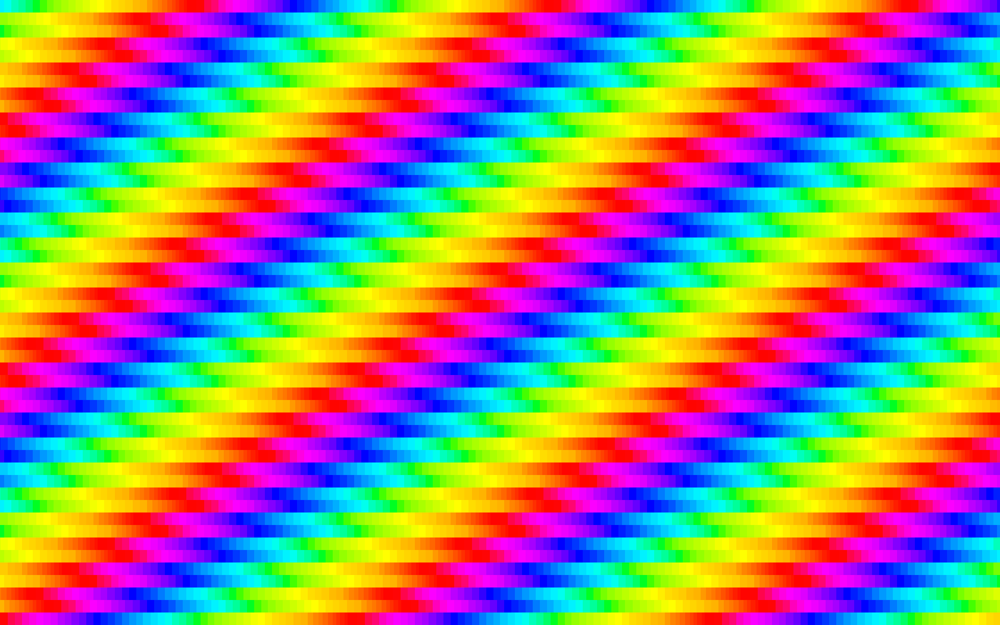

# h

My custom version of [finalboss.org/h/](finalboss.org/h/), (in)complete with different pages and a MowtenDoo reference.

Unfortunately, it is impossible to download `.php` files you don't own, so I can't get the orignal's `text.php`. `text.php` is what enabled the site to make a PNG out of text on the fly, so users could use whatever text they wanted. However, even if I _did_ have it, I wouldn't be able to use it because GitHub Pages doesn't support PHP, anyway.
With the recent transition to SVG for text however, a no-PHP solution is closer than ever. It won't take much more before _all_ of finalboss.org/h/'s original functionality is replicated.

The main difference between this and the original is that the original had hardcoded `div`s that offset the rainbow background. This version uses JavaScript to generate as many `div`s the browser needs to fit the whole page, even when zoomed out to 25%. This change not only leads to more customizability, but it also reduces file size compared to the original. Furthermore, the original's file size would grow with the more `div`s added. When they are generated with JavaScript, the file size stays the same, no matter how many `div`s are requested.

  Offset background                    |  Not-offset background
:-------------------------------------:|:-------------------------------------:
       |  

I didn't make [finalboss.org/h/](finalboss.org/h/) pls no sue
