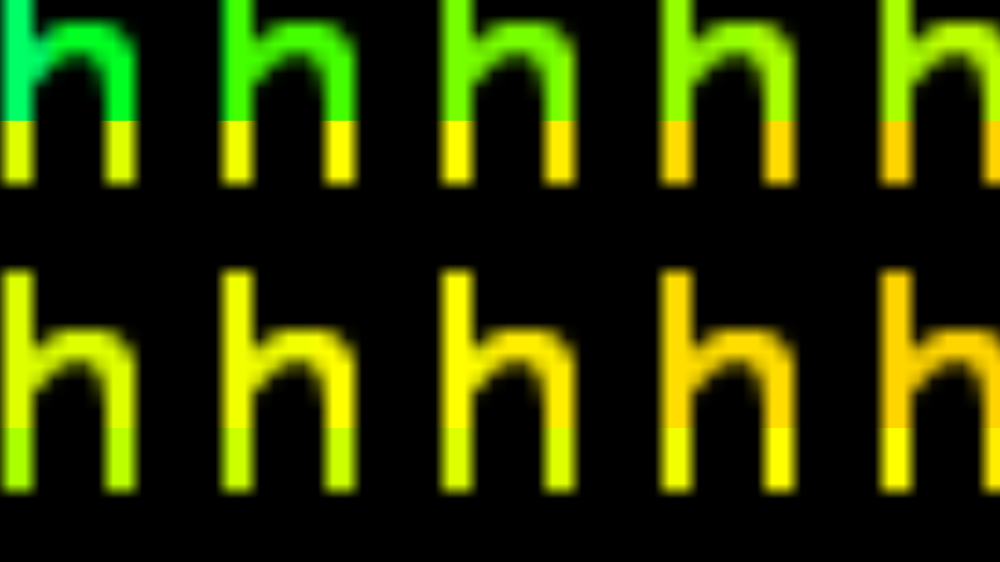

# h

My custom version of [finalboss.org/h/](finalboss.org/h/), (in)complete with several special pages and a MowtenDoo reference.

Unfortunately, it is impossible to download `.php` files you don't own, so I can't get the orignal's `text.php`. `text.php` is what enabled the site to make a PNG out of text on the fly, so users could use whatever text they wanted. However, even if I _did_ have it, I wouldn't be able to use it in GitHub Pages because PHP isn't supported here, anyway.
With the recent transition to SVG for text however, a no-PHP solution is closer than ever. It won't take much more before _all_ of finalboss.org/h/'s original functionality is replicated.

## There are two front-end differences between this and the original:
The original had hardcoded `div`s that offset the rainbow background. This version uses JavaScript to generate as many `div`s the browser needs to fit the whole page, even when zoomed out to 25%. This change not only leads to more customizability, but it also reduces file size compared to the original. Furthermore, the original's file size would grow with the more `div`s added. When they are generated with JavaScript, the file size stays the same, no matter how many `div`s are requested.

  Offset background                    |  Not-offset background
:-------------------------------------:|:-------------------------------------:
       |  

The original used raster graphics for the text. When you were to zoom in then, the text would get blurry and have soft edges, as all raster images do. In my version, vector graphics are used instead, leading to three improvements:
1. The vector I use is smaller than the original's 15x21 PNG
2. Scalable to any size while retaining quality
3. Custom text can now be accomplished without the need for PHP

  Old really close up           |  New really close up
:------------------------------:|:---------------------------:
       |  

**I'm still working on that last one. But it'll be here Soon™!**

## TODO
- Replicate FinalBoss's SPA functionality
- Handle special pages (like /r/) with if-statements in `h.js` instead of redundant pages

---
A _huge_ thank you to the person/people behind [finalboss.org](https://finalboss.org/). You (all) are my inspiration.
