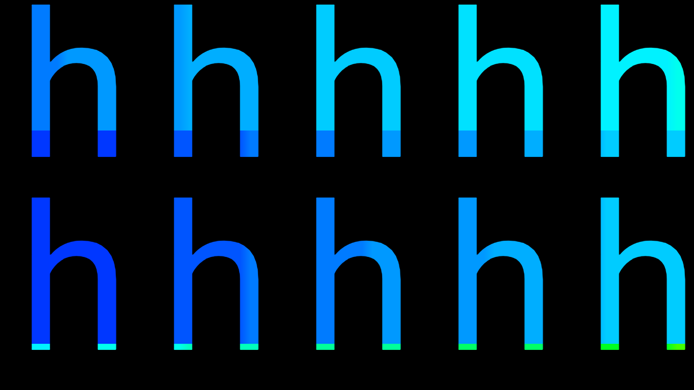
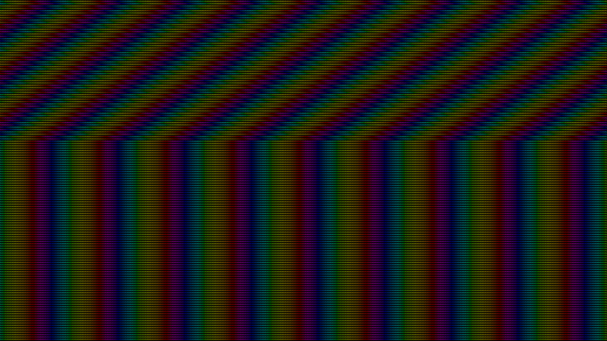
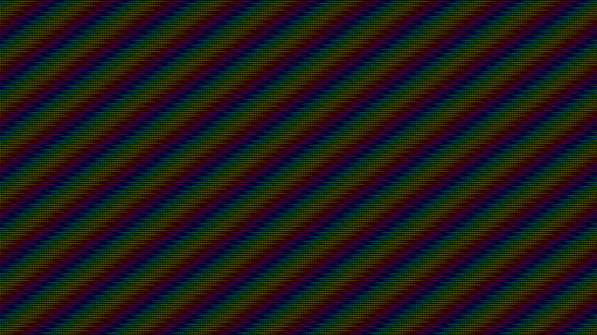

# h

An improved remake of [finalboss.org/h/](finalboss.org/h/)

### Infinite detail
[finalboss.org/h/](finalboss.org/h/) uses traditional raster image files to achieve its effect. When you zoom in, the text becomes blurry and the divisions between the colors of the rainbow background become visible. In this version, both the text and the rainbow background are programmed as SVG instead.

  Old really close up           |  New really close up
:------------------------------:|:---------------------------:
       |  

### Infinite size
The original uses `
`s for each "strip" of the diagonally-staggered rainbow background. Since there is a fixed number of `
`s, there is a limit to how far you can zoom out before you reach the end of the `
`s and the background stops being staggered. With SVG, a single set of rainbow strips can be tiled infinitely using the `<pattern>` tag, making it so that you can zoom out as far as you want and the effect will never stop.

  Not fully staggered background                 |  Fully staggered background
:--------------------------------------------:|:-------------------------------------:
   | 

### Unlocked framerate
The original uses a GIF for the moving rainbow background. As it is a GIF, the effect only has so many frames of animation. In this version, the effect is pulled off with an animated SVG pattern that moves as finely as your display's refresh rate will allow.

## To do
- Add the music back
- Create a visualization for the framerate explanation

---
## A _huge_ thank you to:
- The person/people behind [finalboss.org](https://finalboss.org/). You (all) are my inspiration.
- [Ooer](https://www.reddit.com/r/ooer) (a tech support forum), for helping me debug across multiple platforms.
