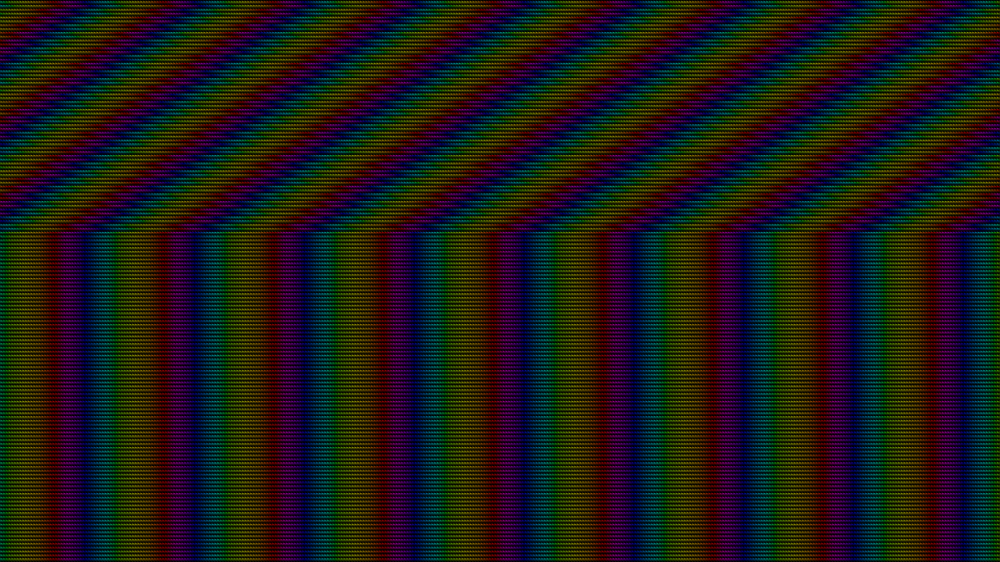

# h

My custom version of [finalboss.org/h/](finalboss.org/h/), (in)complete with several special pages and a MowtenDoo reference.

Unfortunately, it is impossible to download `.php` files you don't own, so I can't get the orignal's `text.php`. `text.php` is what enabled the site to make a PNG out of text on the fly, so users could use whatever text they wanted. However, even if I _did_ have it, I wouldn't be able to use it in GitHub Pages because PHP isn't supported here, anyway.
Actually this turned out to really be a benefit. The fact that I had to rewrite `text.php`'s functionality made it so I found a better solution -- SVG!

## There are two front-end differences between this and the original:
The original had hardcoded `div`s that offset the rainbow background. Since there was always a fixed number of `div`s, there was a limit to how far you could zoom out before the background stopped being diagonal. This version uses JavaScript to generate as many `div`s the browser needs to fit the whole page, even when zoomed out to 25%. This actually reduces file size compared to the original, since the code needed to make the `div`s dynamically turned out to take up less space than the original's hardcoded `div`s. Furthermore, the original's file size would have to grow with more `div`s. When they are generated with JavaScript, the file size stays the same, no matter how many it makes.

  Not fully offset background                 |  Fully offset background
:--------------------------------------------:|:-------------------------------------:
   | 

The original used raster graphics for the text. When you were to zoom in then, the text would get blurry and have soft edges, as all raster images do. In my version, vector graphics are used instead, leading to three improvements:
1. The vector is smaller than the original's 15x21 PNG
2. Scalable to any size while retaining quality
3. No PHP

  Old really close up           |  New really close up
:------------------------------:|:---------------------------:
       |  

## TODO
- Fix spacing for long strings sometimes becoming inaccurate
- Fix SVG having margins that shouldn't be there on iOS(?)

---
## A _huge_ thank you to:
- The person/people behind [finalboss.org](https://finalboss.org/). You (all) are my inspiration.
- [Rafrex](https://github.com/rafrex), who made [Single Page Apps for GitHub Pages](https://github.com/rafrex/spa-github-pages).
- [Ooer](https://www.reddit.com/r/ooer) (a tech support forum), for helping me debug on additional platforms
